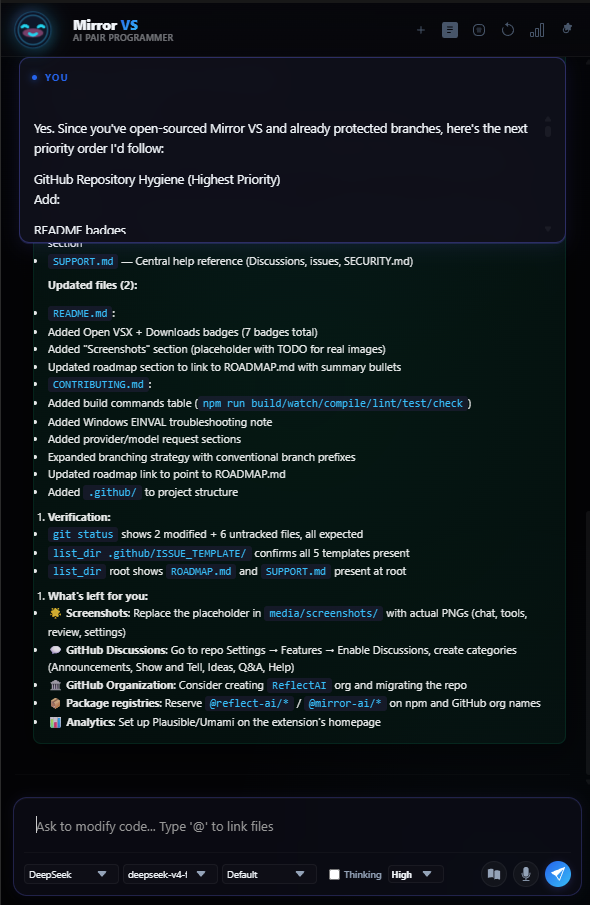
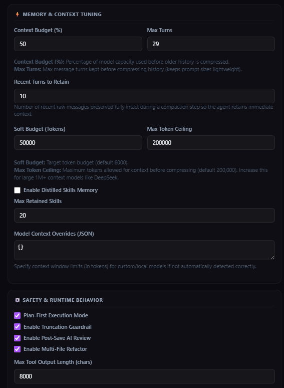
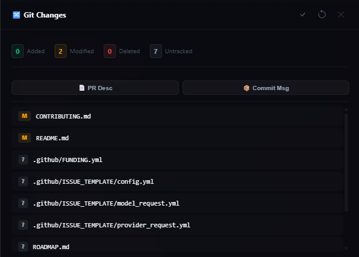

# Mirror VS

Mirror VS is a premium, highly capable, and fully autonomous **AI Pair Programmer** integrated directly into the Visual Studio Code sidebar activity bar. Powered by local **Ollama** models or **DeepSeek's API**, Mirror VS allows you to paired-program, refactor, search, and run workspace actions using simple natural language.

<p align="center">
  
  
  
  
  
  
  
</p>

---

## 📸 Screenshots

<p align="center">
  
  <br/>
  <em>Mirror VS chat interface with streaming responses, tool cards, and buddy avatar</em>
</p>

<p align="center">
  
  <br/>
  <em>Provider configuration, model selection, and extension settings</em>
</p>

<p align="center">
  
  <br/>
  <em>Diff review, commit management, and AI-powered code analysis</em>
</p>

---

## 🌟 Features

### 1. 📱 Unified Multimodal Chat Sidebar
- **Sleek modern UI** with custom dark modes, harmonized accent tones, glassmorphism micro-animations, and an animated **buddy avatar** that reacts to agent activity.
- **Live Streamed Responses**: Direct, fast streaming of text and code token-by-token with typing indicators.
- **Rich Markdown Rendering**: Full markdown support with syntax-highlighted code blocks, inline HTML preview, and file tree rendering.
- **Drag & Drop Files**: Drag files from your OS file explorer directly into the chat to upload context.
- **Slash Commands**: Type `/` in the input box to access quick slash commands for common actions.
- **Inline Screenshots & Visual Assets**: Displays captured browser screenshots and images inline in chat history.

### 2. 🤖 Double-Agent LLM Providers
- **Local Ollama Support**: Run private, fast models locally (`llama3`, `qwen2.5-coder`, `mistral`, `deepseek-r1`) without sending code to the cloud. Includes an auto-refreshing model finder.
- **DeepSeek API Support**: Connect to highly affordable, high-intelligence models (`deepseek-chat`, `deepseek-coder`, `deepseek-reasoner`, `deepseek-v4-flash`, `deepseek-v4-pro`) for complex programming tasks.
- **Provider Fallback**: Automatic fallback between providers if the primary provider fails, ensuring high availability.
- **Teacher Escalation**: When a local model fails repeatedly, the system can escalate to a more powerful teacher model (e.g., deepseek-v4-pro) for recovery.

### 3. 🌍 Multi-Provider Ecosystem
- **OpenRouter**: Connect to dozens of models through OpenRouter's unified API.
- **LiteLLM**: Use any model supported by LiteLLM (Anthropic, OpenAI, Google, etc.).
- **Google Gemini**: Direct Gemini API support.
- **Custom Endpoints**: Configure any OpenAI-compatible API endpoint.

### 4. 🛠️ Fully Autonomous Workspace Tools
Mirror VS executes a multi-turn, goal-driven loop using high-precision XML tags to perform actions directly on your system:

- 📂 **High-Precision File Editing**: Create files or perform precise, Git-safe, diff-based line edits (`patch_file` / `write_file`) rather than full-file rewrites.
- 💻 **Smart Terminal Controller**: Execute commands, start development servers in the background, send interactive keystrokes (like `Ctrl+C` to kill processes), or manage multiple terminal instances.
- 🌐 **Real-time Web Browser Integration**: Navigates URLs, clicks buttons, inputs text, returns DOM layouts, and captures screenshots automatically to verify server states or debug UI builds.
- 🔍 **Grep Code Search**: Recursively scan your workspace for variables, patterns, and methods with ripgrep integration.
- 🧪 **Test Runner Integration**: Discover, run, and analyze test suites directly from the agent using VS Code's native Testing API.
- 🖼️ **Figma Integration**: Fetch and inspect Figma design nodes to get layout specs, colors, and typography directly in your workflow.
- 🧠 **Code Analysis**: Language server powered diagnostics, symbol search, and workspace intelligence.

### 5. 🔄 Git-Protected Review & Revert System
- Every file operation creates a **git baseline snapshot** on your behalf.
- Visual diff gutter colors (yellow for modified, green for added, red for deleted).
- **Side-by-side diff review** with keyboard navigation (`Alt+J` / `Alt+K`).
- Instantly accept, compare (`mirror-vs.diffReview`), or rollback edits (`mirror-vs.rejectReview`) directly from the extension.
- **Accept All Changes** command for bulk approval.

### 6. 🧠 Smart Workspace Contexts
- **Active File Context**: Automatically detects and highlights the active file in the sidebar.
- **Multi-File Autocomplete**: Reference multiple files using `@` autocomplete tags to supply rich context.
- **Context Optimizing Guardrails**: Automatic LLM summarization compresses older conversational turns, maintaining rapid speed and low token overhead.
- **Adaptive Token Budget**: Automatically adjusts input token budgets based on the model's context window.

### 7. 🎨 Custom Modes & Skills
- **Custom Modes Manager**: Define custom agent modes with specific tool restrictions and prompts.
- **Agent Skills**: Modular skill system (React, Backend, Debug, Refactor) that teaches the agent best practices for different technologies.
- **Plan-First Mode**: Enforce a disciplined workflow where the agent must declare an implementation plan before executing any file modification.

### 8. 🧩 MCP (Model Context Protocol) Support
- **Dynamic Tool Discovery**: Connect to any MCP server and automatically discover available tools.
- **MCP Configuration UI**: Configure MCP servers directly from the sidebar settings panel.
- **Seamless Integration**: MCP tools appear alongside native tools in the agent's toolbox.

### 9. 🧠 Memory & Persistence
- **Agent Memory Service**: Persistent cross-session memory for the Mirror VS agent, retaining important context between conversations.
- **Session Management**: Save, restore, and switch between multiple chat sessions.
- **Auto-Save**: Chat history is automatically persisted and restored on extension reload.

### 10. 🧪 AI Review & Code Quality
- **Post-Save Auto-Review**: Automatically reviews code changes after save and suggests improvements.
- **Diff-Aware Analysis**: Analyzes uncommitted git changes and provides AI-powered review comments.
- **Context Budget Enforcement**: Intelligent context window management prevents token overflow.

---

## 🚀 Quick Start

### 1. Prerequisites

You need one or both of the following backends:

*   **Ollama (Fully Local & Private)**:
    1. Download and install from [ollama.com](https://ollama.com).
    2. Start the Ollama server on your machine.
    3. Pull your preferred coding model:
       ```bash
       ollama pull qwen2.5-coder:7b
       # Or for reasoning/agentic work:
       ollama pull deepseek-r1:8b
       # Or the default standard model:
       ollama pull llama3
       ```

*   **DeepSeek API (High Intelligence Cloud)**:
    1. Create an account on the [DeepSeek Platform](https://platform.deepseek.com).
    2. Generate an API Key under the API Keys tab.
    3. *(Optional)* Enable **DeepSeek Thinking Mode** in settings for enhanced reasoning.

*   **OpenRouter / LiteLLM / Gemini** (Optional):
    1. Obtain an API key from your chosen provider.
    2. Configure the provider and key in the Mirror VS settings panel.

### 2. Launch & Configuration

1. Launch **Visual Studio Code**.
2. Click the **Mirror VS logo** in the Activity Bar on the far left side of the window.
3. Open the **Settings Drawer** (gear icon ⚙️ in the top-right header).
4. Configure your preferred settings:
   - **Provider**: Choose `ollama`, `deepseek`, `openrouter`, `litellm`, or `gemini`.
   - **Ollama Host**: Defaults to `http://localhost:11434`.
   - **Ollama Model**: Type the exact model name (e.g., `qwen2.5-coder:7b`).
   - **DeepSeek Key**: Securely input your DeepSeek API Key.
   - **MCP Servers**: Configure any MCP-compatible servers for extended tooling.

### 3. Keyboard Shortcuts

| Shortcut | Action |
| :--- | :--- |
| `Ctrl+Shift+M` / `Cmd+Shift+M` | Focus Mirror VS Sidebar |
| `Ctrl+Shift+L` / `Cmd+Shift+L` | Clear Active Chat Session |
| `Alt+Enter` | Accept Changes |
| `Ctrl+Enter` (when in review) | Accept Changes |
| `Alt+J` (when in review) | Next Review Change |
| `Alt+K` (when in review) | Previous Review Change |
| `Ctrl+Shift+F` / `Cmd+Shift+F` (with selection) | Fix with Mirror VS |
| `Ctrl+Shift+E` / `Cmd+Shift+E` (with selection) | Explain with Mirror VS |

---

## 🔒 Security & Privacy Guarantees

Mirror VS is built with security first in mind:

- **🔐 Local Isolation**: With the Ollama provider, **100% of your source code and conversations remain entirely local**. No telemetry data is sent to external servers.
- **🔑 Encrypted Secret Storage**: API keys are stored using VS Code's native [SecretStorage API](https://code.visualstudio.com/api/references/vscode-api#SecretStorage), which integrates with your OS credential manager (Windows Credential Manager, macOS Keychain, Linux libsecret).
- **🛡️ Git Sandboxing**: Every autonomous tool execution creates a git checkpoint, enabling clean comparison and revert.
- **🚦 Terminal Safety**: Sensitive commands are detected and require human confirmation before execution.
- **🧪 Prompt Security**: Built-in prompt injection detection and sanitization.

---

## ⚙️ Configuration Settings

Customize Mirror VS via `settings.json` or the interactive Settings Panel:

| Setting Key | Type | Default | Description |
| :--- | :--- | :--- | :--- |
| `mirror-vs.defaultProvider` | `string` | `"ollama"` | Active LLM Provider (`ollama`, `deepseek`, `openrouter`, `litellm`, `gemini`). |
| `mirror-vs.ollamaHost` | `string` | `"http://localhost:11434"` | Base URL of your running Ollama server. |
| `mirror-vs.defaultOllamaModel` | `string` | `"llama3"` | Default local Ollama model. |
| `mirror-vs.defaultDeepSeekModel` | `string` | `"deepseek-v4-pro"` | Default DeepSeek model. |
| `mirror-vs.planFirst` | `boolean` | `true` | Enforce Plan-First mode (agent must declare implementation plan before editing files). |
| `mirror-vs.deepSeekThinking` | `boolean` | `true` | Enable DeepSeek V4 Thinking Mode. |
| `mirror-vs.teacherEnabled` | `boolean` | `false` | Enable teacher-student escalation loop for local model failures. |
| `mirror-vs.teacherModel` | `string` | `"deepseek-v4-pro"` | Senior teacher model for failure recovery. |
| `mirror-vs.maxTurnsBeforeSummarize` | `number` | `16` | Max turns before conversation context is compressed. |
| `mirror-vs.turnsToRetain` | `number` | `6` | Recent turns to retain after compression. |
| `mirror-vs.contextBudgetPercent` | `number` | `75` | Context window budget utilization percentage. |
| `mirror-vs.agentInputTokenBudget` | `number` | `6000` | Adaptive soft input token budget. |
| `mirror-vs.agentInputTokenHardMax` | `number` | `200000` | Ceiling for long-context model budgets. |
| `mirror-vs.maxProjectMapLines` | `number` | `250` | Max lines for project map context (range 10–5000). |
| `mirror-vs.maxToolOutputLength` | `number` | `8000` | Max characters captured from tool output for context. |

---

## 🛠️ Commands

Run these from the VS Code **Command Palette** (`Ctrl+Shift+P` / `Cmd+Shift+P`):

| Command | ID | Description |
| :--- | :--- | :--- |
| `Focus Mirror VS Sidebar` | `mirror-vs.focusSidebar` | Open and focus the assistant sidebar |
| `Clear Active Chat Session` | `mirror-vs.clearChat` | Clear all current messages |
| `Compare Changes` | `mirror-vs.diffReview` | Compare agent modifications against git baseline |
| `Accept Changes` | `mirror-vs.acceptReview` | Accept all active agent edits |
| `Reject Changes` | `mirror-vs.rejectReview` | Roll back and reject modifications |
| `Accept All Changes` | `mirror-vs.acceptAllReviews` | Bulk accept all pending review changes |
| `Previous Review Change` | `mirror-vs.prevChange` | Navigate to previous change in diff review |
| `Next Review Change` | `mirror-vs.nextChange` | Navigate to next change in diff review |
| `Fix with Mirror VS` | `mirror-vs.fixSelection` | Fix selected code using the agent |
| `Explain with Mirror VS` | `mirror-vs.explainSelection` | Explain selected code using the agent |

---

## 💻 Local Development & Contributing

```bash
# Clone the repository
git clone https://github.com/DipeshMajithia/mirror-vs.git
cd mirror-vs

# Install dependencies
npm install

# Start development watcher
npm run watch

# Launch Extension Development Host (F5)
```

### Project Structure

```
mirror-vs/
├── src/
│   ├── agent/          # Agent logic, tools, prompts, and orchestration
│   ├── services/       # Core services (API, storage, MCP, etc.)
│   ├── providers/      # LLM provider implementations
│   ├── webview/        # Sidebar UI (HTML/CSS/JS)
│   ├── types/          # TypeScript type definitions
│   └── utils/          # Shared utilities
├── media/              # Static assets
├── resources/          # Extension icons
└── scratch/            # Temporary workspace files
```

---

## 🗺️ Roadmap

See the full [ROADMAP.md](ROADMAP.md) for the detailed development plan across v0.3 → v1.0.

High-level priorities:

- **v0.3** — Persistent memory, better MCP UI, voice input, provider fallback improvements
- **v0.4** — Multi-model chat sessions, enhanced artifacts, VS Code notebooks, custom tool plugins
- **v0.5** — PR generation, code review agent, multi-file refactoring, git workflow assistance
- **v1.0** — Mirror PAI integration, performance optimization, marketplace publication

---

## 🤝 Contributing

We welcome contributions! Here's how to get started:

- 🐛 Found a bug? Open a [Bug Report](https://github.com/DipeshMajithia/mirror-vs/issues/new?template=bug_report.yml)
- 💡 Have an idea? Open a [Feature Request](https://github.com/DipeshMajithia/mirror-vs/issues/new?template=feature_request.yml)
- 👋 Want to help? Look for [good first issues](https://github.com/DipeshMajithia/mirror-vs/labels/good%20first%20issue) and [help wanted](https://github.com/DipeshMajithia/mirror-vs/labels/help%20wanted)

See [CONTRIBUTING.md](CONTRIBUTING.md) for full development setup and contribution guidelines.

---

## 🛡️ License

This extension is licensed under the [MIT License](LICENSE). Built with ❤️ by [Dipesh Majithia](https://github.com/DipeshMajithia).