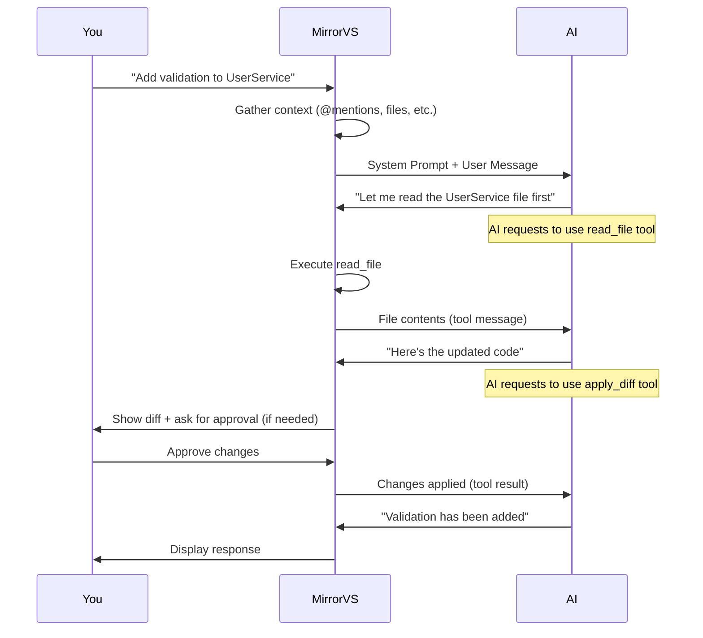

# Prompt Structure

## What's Really Going On Under the Hood

When you type a message to Mirror VS, it's not just sending that text to the AI model. There's a whole machinery behind the scenes that assembles your request into a structured conversation. Think of it as a sandwich — your prompt is the filling, but there's a lot of bread you don't see.

## Core Message Types

Mirror VS uses four types of messages to communicate with the AI model:

| Message Type           | Purpose                                           | Who Sends It          |
| ---------------------- | ------------------------------------------------- | --------------------- |
| **System Prompt**      | Sets the AI's behavior, identity, and constraints | Mirror VS (automatic) |
| **User Messages**      | Your actual requests and instructions             | You                   |
| **Assistant Messages** | The AI's responses                                | AI Model              |
| **Tool Messages**      | Results of tool executions                        | Mirror VS (automatic) |

The order matters. Messages are sent in sequence, and each one builds on the context of everything that came before.

## System Prompt

Every conversation starts with a system prompt — a block of instructions that tells the AI who it is and how to behave. This is where Mirror VS defines:

- The AI's role (expert coding assistant, architect, debugger, etc.)
- Available tools and how to use them
- Rules about code style and best practices
- Constraints (don't delete files without asking, etc.)

You never write the system prompt yourself, but you influence it through:

- **Custom instructions** → appended to the system prompt
- **Mode selection** → changes the role definition and available tools
- **Custom modes** → completely customized system prompt for specific workflows

### System Prompt Anatomy

The system prompt is constructed from these components, in order:

1. **Core identity** — "You are Mirror VS, an AI coding assistant..."
2. **Mode-specific instructions** — What this mode does and its available tools
3. **Custom instructions** (global) — Your persistent rules from `~/.mirror/rules/`
4. **Custom instructions** (workspace) — Project-specific rules
5. **Mode-specific instructions** — Instructions for the current `.clinerules-{mode}` file

It's like a Matryoshka doll of instructions — each layer adds more specificity.

## User Messages

These are your prompts — what you type into the chat. But Mirror VS enriches them before sending:

```
Your Input: "Refactor the auth module"
                            ↓
What the AI Receives: "The user wants you to refactor the auth module.
Current working directory: /projects/my-app. Available context:
files mentioned via @mentions, terminal output, and problem markers."
```

The enrichment includes:

- **Context mentions** → file contents, folder structures, terminal output
- **Current state** → project structure, recent changes
- **Tool results** → output from previous tool calls

## Assistant Messages

These are the AI's responses. They can contain:

- **Text content**: Explanations, analysis, questions back to you
- **Tool use blocks**: Requests to use tools like `read_file`, `apply_diff`, `execute_command`

Mirror VS intercepts tool use blocks, executes them, and sends the results back as tool messages. The AI never has direct access to your filesystem or terminal — it asks Mirror VS to do things, and Mirror VS reports back on what happened.

## Message Flow

Here's what actually happens when you send a message:



This back-and-forth happens automatically. To you, it feels like the AI is just doing things. Behind the scenes, it's a carefully orchestrated dance of messages, tool calls, and responses.

## Technical Implementation

The system prompt is generated in [`src/core/prompts/system.ts`](/src/core/prompts/system.ts). If you're curious about the gory details, that's where the magic happens.

The prompt assembly process:

1. Loads the base system prompt template
2. Injects mode-specific tool definitions
3. Appends custom instructions from all sources
4. Adds current project context (directory structure, etc.)
5. Adds tool-specific guidelines (how to use `apply_diff`, `read_file`, etc.)

The result is a comprehensive system prompt that can be thousands of tokens long before you've even said a word.

## Supporting Prompts

Beyond the core system prompt, Mirror VS uses additional prompts for specific scenarios:

| Scenario              | Purpose                                             |
| --------------------- | --------------------------------------------------- |
| **Mode switching**    | Informs the AI about the new mode's scope and tools |
| **Task completion**   | Prompted when a task is marked as complete          |
| **New task creation** | Resets context and sets up for a new goal           |
| **Tool errors**       | Explains what went wrong and suggests recovery      |

## Optimizing Your Interactions

Now that you understand the plumbing, you can work smarter:

- **Heavy context early**: Put important context at the beginning of your message. The AI pays more attention to what comes first.
- **One topic per message**: Each user message is a new opportunity for the AI to focus. Don't cram three unrelated tasks into one message.
- **Use custom instructions**: Instead of repeating preferences every conversation, put them in custom instructions. They get baked into every system prompt.
- **Be aware of context limits**: The system prompt + conversation history + your message = total context. If the AI starts forgetting things, you might be hitting the ceiling.

Remember: Mirror VS's prompt system is designed to make the AI as effective as possible. Understanding how it works helps you work _with_ it, not against it.
